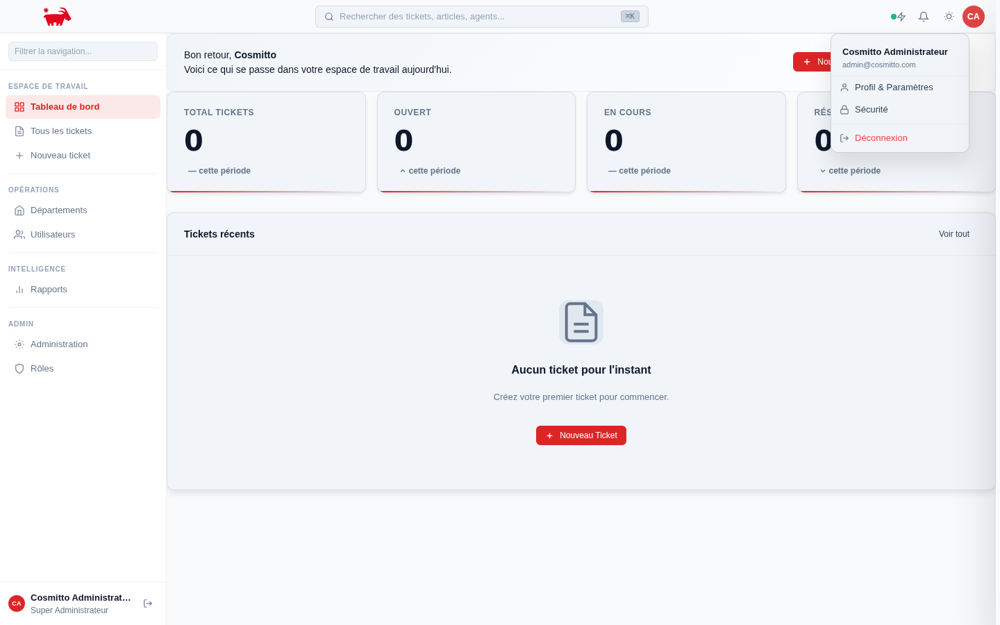
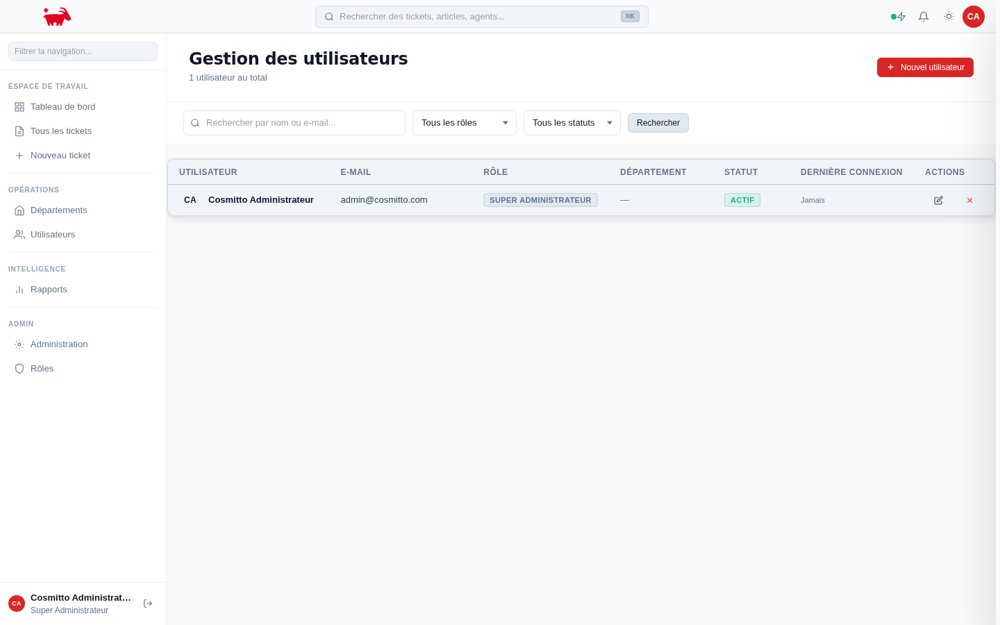
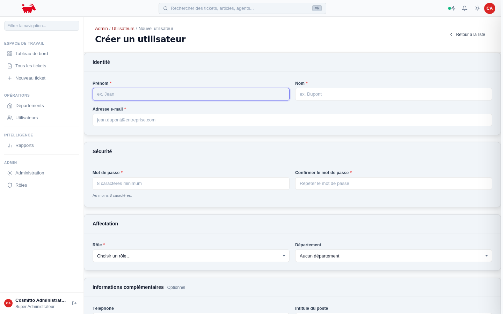
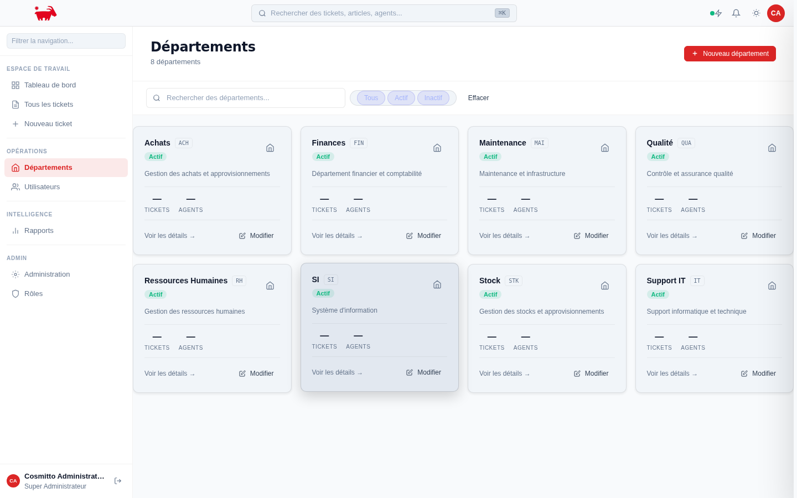
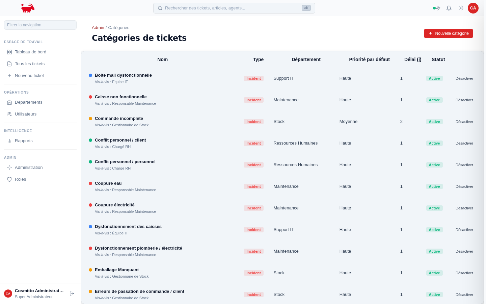
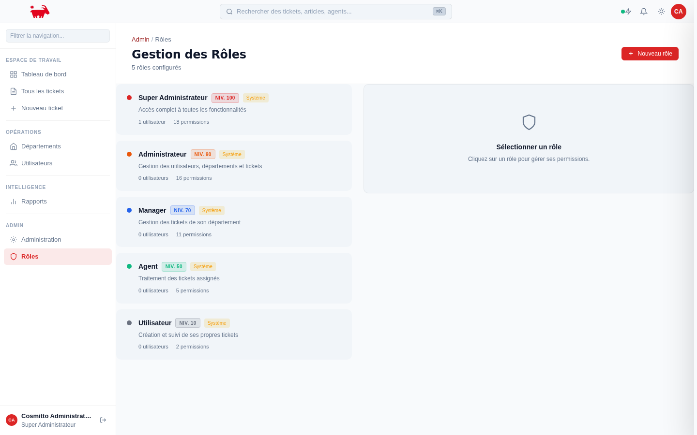
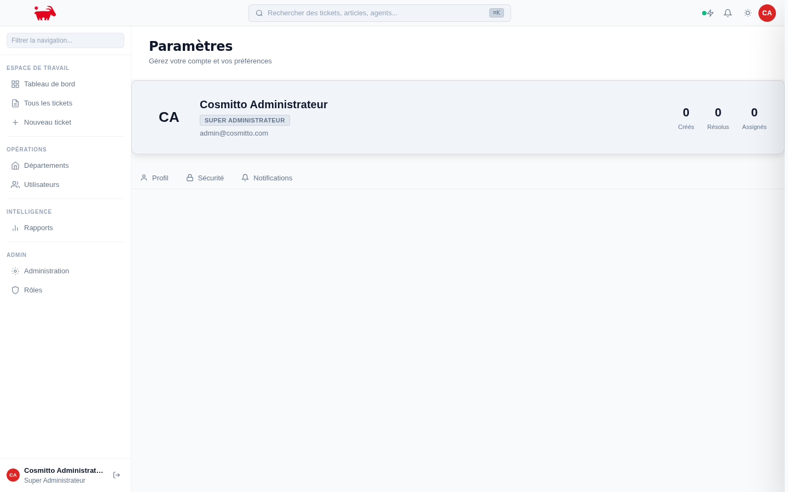
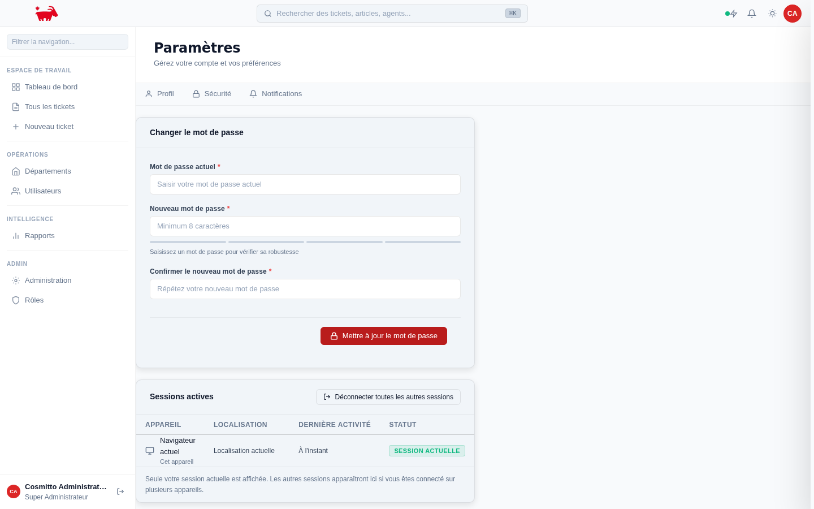

# Guide Utilisateur — CosmittoHUB

**Plateforme de gestion des opérations — Cosmitto Coffee**

---

## Table des matières

1. [Connexion](#1-connexion)
2. [Tableau de bord](#2-tableau-de-bord)
3. [Tickets](#3-tickets)
   - [Liste des tickets](#31-liste-des-tickets)
   - [Créer un nouveau ticket](#32-créer-un-nouveau-ticket)
4. [Menu utilisateur](#4-menu-utilisateur)
5. [Administration](#5-administration)
   - [Tableau de bord admin](#51-tableau-de-bord-admin)
   - [Gestion des utilisateurs](#52-gestion-des-utilisateurs)
   - [Départements](#53-départements)
   - [Catégories de tickets](#54-catégories-de-tickets)
   - [Rôles et permissions](#55-rôles-et-permissions)
   - [Rapports](#56-rapports)
6. [Paramètres du compte](#6-paramètres-du-compte)
   - [Profil](#61-profil)
   - [Sécurité](#62-sécurité)

---

## 1. Connexion

Pour accéder à CosmittoHUB, rendez-vous sur l'URL fournie par votre administrateur.

**Procédure :**

1. Saisissez votre **adresse e-mail** professionnelle dans le champ correspondant.
2. Entrez votre **mot de passe** (utilisez l'icône œil pour l'afficher/masquer).
3. Cochez **Se souvenir de moi** si vous souhaitez rester connecté sur cet appareil.
4. Cliquez sur **Se connecter**.

> Si vous avez oublié votre mot de passe, cliquez sur **Mot de passe oublié ?** pour recevoir un lien de réinitialisation par e-mail.

---

## 2. Tableau de bord

Le tableau de bord est la page d'accueil après connexion. Il présente une vue synthétique de l'activité en cours.

**Éléments affichés :**

| Zone | Description |
|------|-------------|
| **Compteurs en haut** | Total des tickets ouverts, en cours, résolus et en attente |
| **Activité récente** | Les derniers tickets créés ou mis à jour |
| **Statistiques** | Répartition par priorité et par département |

La **barre latérale gauche** (sidebar) permet de naviguer entre les sections. Elle affiche votre nom et rôle en bas, ainsi qu'un bouton de déconnexion.

---

## 3. Tickets

### 3.1 Liste des tickets

La liste des tickets affiche tous les tickets auxquels vous avez accès selon votre rôle.

**Fonctionnalités :**

- **Filtres** : par statut, priorité, département, catégorie ou assigné
- **Recherche** : par mot-clé dans le titre ou la description
- **Tri** : cliquez sur les en-têtes de colonnes pour trier
- **Pagination** : navigation entre les pages de résultats

Chaque ligne affiche : le numéro de ticket, le titre, le département, la priorité (colorée), le statut et la date de création.

Cliquez sur un ticket pour accéder à son **détail complet** : description, commentaires, historique, pièces jointes et actions disponibles.

---

### 3.2 Créer un nouveau ticket

Pour créer un ticket, cliquez sur **Nouveau ticket** dans la barre latérale ou depuis la liste.

**Étapes de création :**

1. **Sélectionnez le type** de ticket (Incident, Demande, Besoin, Plainte, Tâche) en cliquant sur la carte correspondante.

2. **Choisissez une catégorie** parmi les cartes affichées, regroupées par département. Le département est automatiquement assigné selon la catégorie sélectionnée.

3. **Remplissez les champs** :
   - **Titre** : description courte et claire du problème ou de la demande
   - **Description** : détails complets, contexte, étapes pour reproduire, etc.
   - **Priorité** : pré-remplie selon la catégorie, modifiable si nécessaire
   - **POS / Point de vente** : sélectionnez le point de vente concerné (si applicable)

4. Cliquez sur **Créer le ticket** pour soumettre.

> **Bon à savoir :** La priorité par défaut est automatiquement suggérée selon la catégorie choisie. Vous pouvez la modifier avant de soumettre.

---

## 4. Menu utilisateur

Cliquez sur votre **avatar** (initiales en bas de la sidebar) pour ouvrir le menu utilisateur.

**Options disponibles :**

- **Profil** : accéder et modifier vos informations personnelles
- **Paramètres** : gérer votre compte et la sécurité
- **Déconnexion** : se déconnecter de l'application

---

## 5. Administration

> Les sections suivantes sont accessibles uniquement aux utilisateurs ayant un rôle **Administrateur** ou **Manager**.

### 5.1 Tableau de bord admin

Le tableau de bord administrateur offre une vue globale de la plateforme :

- **Statistiques globales** : nombre total d'utilisateurs, tickets actifs, taux de résolution
- **Tickets récents** : aperçu des derniers tickets créés sur l'ensemble des POS
- **Activité système** : actions récentes effectuées sur la plateforme
- **Accès rapides** : liens directs vers les sections d'administration

---

### 5.2 Gestion des utilisateurs

La section **Utilisateurs** liste tous les comptes de la plateforme.

**Informations affichées :** nom, e-mail, département, rôle, date de création, statut (actif/inactif).

#### Créer un nouvel utilisateur

Cliquez sur **Nouvel utilisateur** et remplissez le formulaire :

| Champ | Obligatoire | Description |
|-------|-------------|-------------|
| Prénom / Nom | ✓ | Identité complète |
| Adresse e-mail | ✓ | Utilisée pour la connexion |
| Mot de passe | ✓ | Minimum 8 caractères |
| Rôle | ✓ | Définit les permissions de l'utilisateur |
| Département | ✓ | Service d'appartenance |
| Téléphone | — | Numéro de contact interne |
| Poste | — | Intitulé du poste |
| Matricule | — | Identifiant RH (doit être unique) |

> **Rôles disponibles :** Administrateur, Manager, Agent, Utilisateur — chacun avec un niveau d'accès différent.

---

### 5.3 Départements

Les **départements** structurent l'organisation. Chaque ticket est rattaché à un département, et les utilisateurs en font partie.

**Actions possibles :**

- **Créer** un département (nom, description, couleur)
- **Modifier** un département existant
- **Activer / Désactiver** un département

Les départements inactifs n'apparaissent plus dans les formulaires de création de ticket.

---

### 5.4 Catégories de tickets

Les **catégories** permettent de classer précisément chaque ticket et de définir des paramètres par défaut.

**Informations par catégorie :**

- **Nom** et couleur d'identification
- **Type** de ticket associé (incident, demande, etc.)
- **Département** propriétaire
- **Priorité par défaut** (pré-remplie lors de la création d'un ticket)
- **Délai de résolution** en jours (SLA indicatif)
- **Statut** actif/inactif

#### Créer une catégorie

Cliquez sur **Nouvelle catégorie** et renseignez :

1. **Nom** de la catégorie (ex. : "Panne matérielle", "Commande fournisseur")
2. **Description** courte (optionnel)
3. **Type de ticket** et **Département** responsable
4. **Priorité par défaut** et **Délai de résolution**
5. **Couleur** pour identifier visuellement la catégorie

---

### 5.5 Rôles et permissions

Les **rôles** définissent ce que chaque utilisateur peut faire dans CosmittoHUB.

**Rôles prédéfinis :**

| Rôle | Accès |
|------|-------|
| **Administrateur** | Accès complet — gestion de la plateforme, utilisateurs, configuration |
| **Manager** | Supervision des équipes, rapports, validation de tickets |
| **Agent** | Traitement des tickets assignés, commentaires, changement de statut |
| **Utilisateur** | Création et suivi de ses propres tickets uniquement |

---

### 5.6 Rapports

La section **Rapports** permet d'analyser les performances et l'activité de la plateforme.

**Rapports disponibles :**

- **Volume de tickets** : évolution dans le temps, par département ou catégorie
- **Temps de résolution** : délai moyen de traitement par priorité ou équipe
- **Taux de résolution** : pourcentage de tickets résolus dans les délais SLA
- **Performance par agent** : nombre de tickets traités, délai moyen

Utilisez les **filtres de période** (semaine, mois, trimestre) pour affiner l'analyse.

---

## 6. Paramètres du compte

### 6.1 Profil

Accédez à vos paramètres via le menu utilisateur → **Paramètres**.

**Informations modifiables :**

- Prénom et nom d'affichage
- Adresse e-mail
- Numéro de téléphone
- Poste et matricule
- Photo de profil (avatar)

Cliquez sur **Enregistrer** pour sauvegarder vos modifications.

---

### 6.2 Sécurité

L'onglet **Sécurité** vous permet de :

- **Changer votre mot de passe** : saisissez l'ancien mot de passe, puis le nouveau (2 fois pour confirmation)
- **Voir les sessions actives** : visualiser les connexions en cours sur votre compte
- **Révoquer les sessions** : déconnecter un appareil à distance si nécessaire

> **Recommandation :** Utilisez un mot de passe d'au moins 12 caractères, mélangeant majuscules, chiffres et caractères spéciaux.

---

## Aide et support

Pour toute question ou signalement d'anomalie sur la plateforme elle-même, contactez votre administrateur système ou créez un ticket dans la catégorie **Support IT**.

---

*CosmittoHUB — Gestion des opérations Cosmitto Coffee · Documentation interne*
